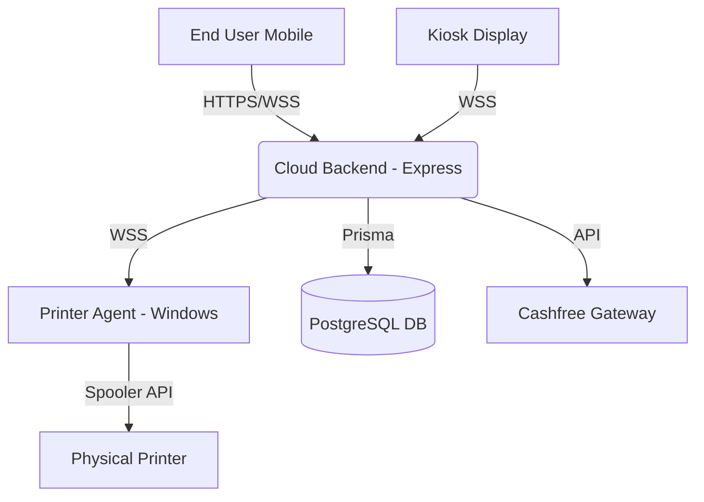

# PrintGo Architecture

## System Overview



## Backend Clean Architecture

The backend codebase has been refactored from a monolithic script to a highly scalable Clean Architecture model.

```
backend/
├── prisma/
│   └── schema.prisma        # Database schema definitions
├── src/
│   ├── middlewares/         # auth.js, error.js
│   ├── modules/             # Feature-based vertical slices
│   │   ├── auth/            # Authentication & Authorization
│   │   ├── companies/       # Franchisee Management
│   │   ├── jobs/            # Print Jobs queue & state management
│   │   ├── machines/        # Kiosk Hardware records & status
│   │   ├── payments/        # Cashfree integration
│   │   ├── subscriptions/   # SaaS tier enforcement
│   │   └── upload/          # File handling (multer/s3)
│   ├── services/            # Background workers (BullMQ)
│   ├── utils/               # AppError.js, logger.js, prisma.js
│   ├── server.js            # Express setup & middleware mounting
│   └── socket.js            # Unified WebSocket event handler
└── package.json
```

## Database Schema (Relational Model)

- **Company:** The franchisee purchasing the kiosks and software.
- **User:** Staff/Admins attached to a Company.
- **Machine:** The physical kiosk hardware (linked to a Company via MachineKey).
- **Subscription:** Links a Machine to a Plan (e.g., Starter, Enterprise) with expiry dates.
- **PrintJob:** A single requested print instance (file URL, settings, cost, ETA).
- **Payment:** Financial transactions linked to PrintJobs.
- **PrinterStatus & Telemetry:** Time-series diagnostics for monitoring machine health.

## Socket Real-time Flow

1. User scans Kiosk QR -> Kiosk emits `join_session`.
2. Mobile device opens URL -> Mobile emits `mobile_connected`.
3. Kiosk receives event and moves to "Connected" step.
4. Mobile uploads file -> Cloud processes -> Cloud emits `kiosk_file_uploaded`.
5. Mobile updates settings -> Cloud emits `kiosk_settings_updated`.
6. Mobile pays -> Webhook hits Cloud -> Cloud emits `job_status_changed`.
7. Cloud sends `physical_print_job` to Printer Agent.
8. Printer Agent downloads PDF -> sends to spooler -> emits `print_spooler_success`.
9. Cloud updates job to 'Completed' -> Mobile & Kiosk show success UI.
