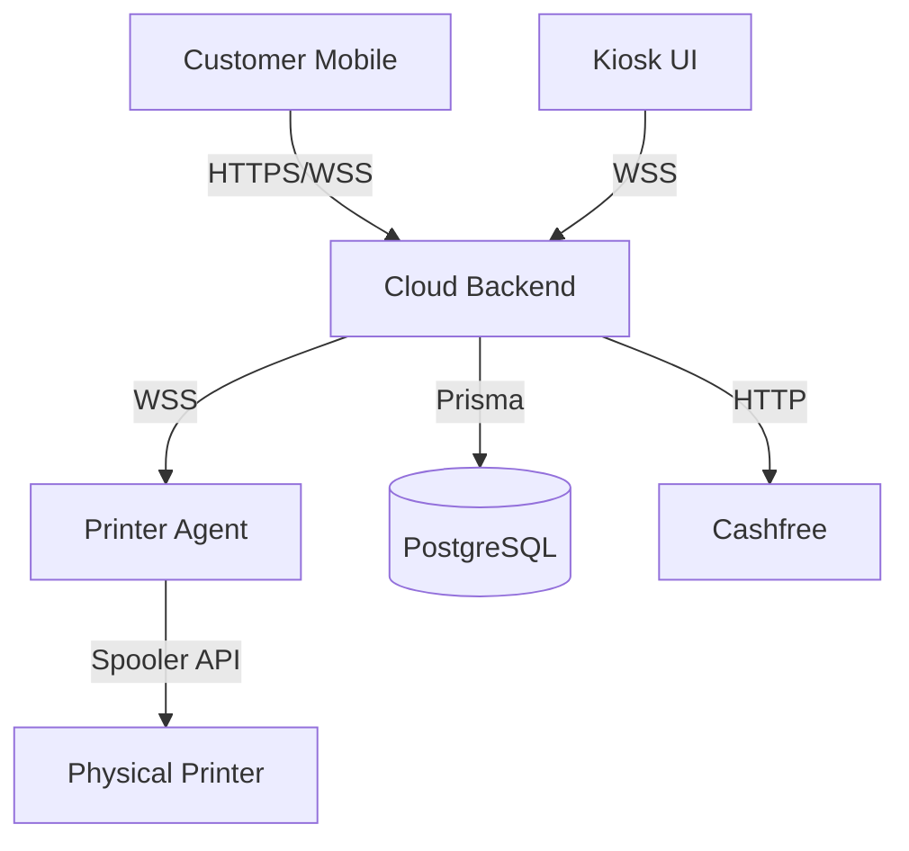
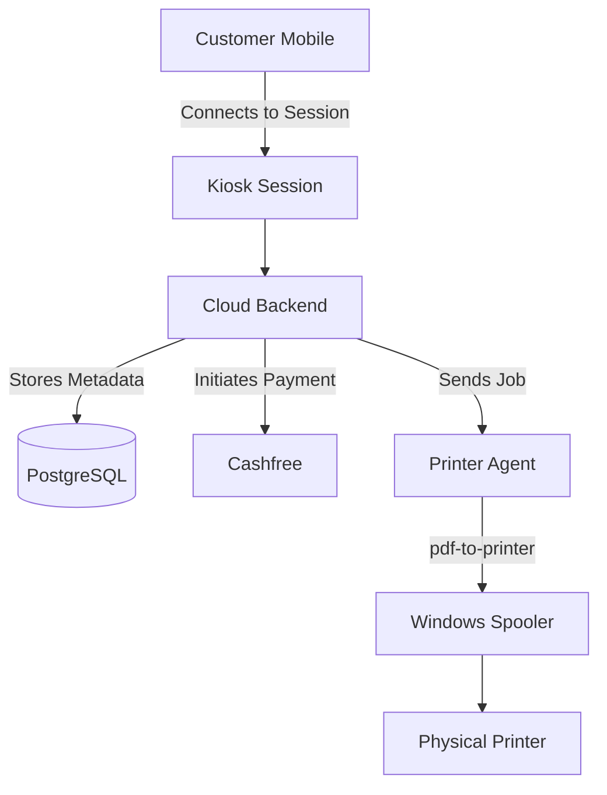
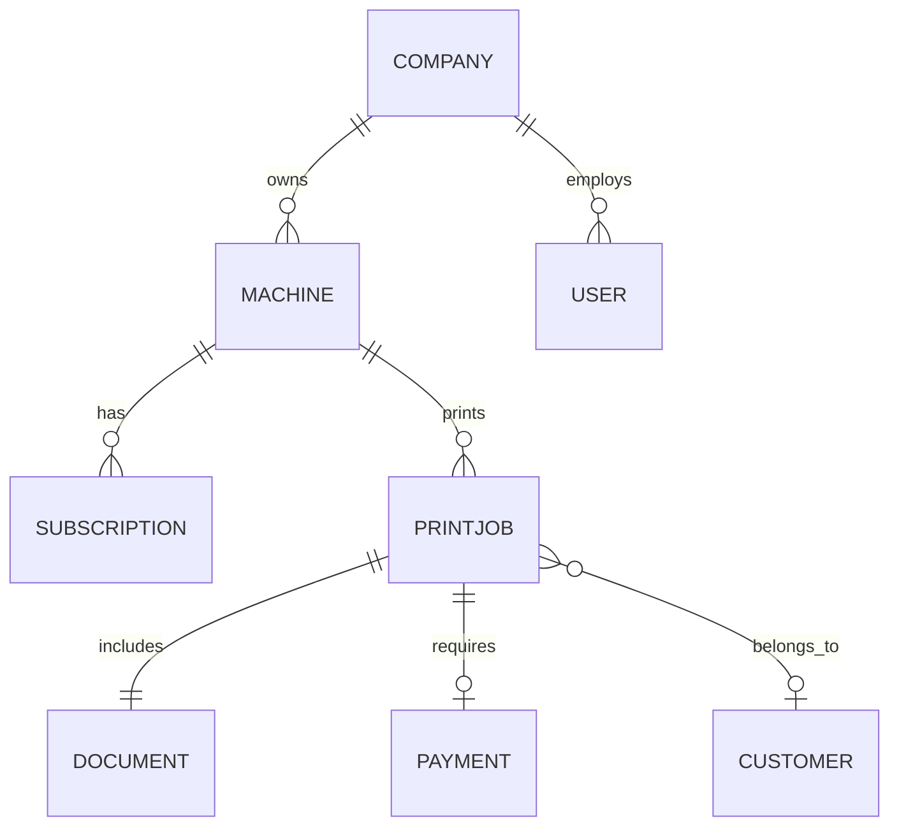
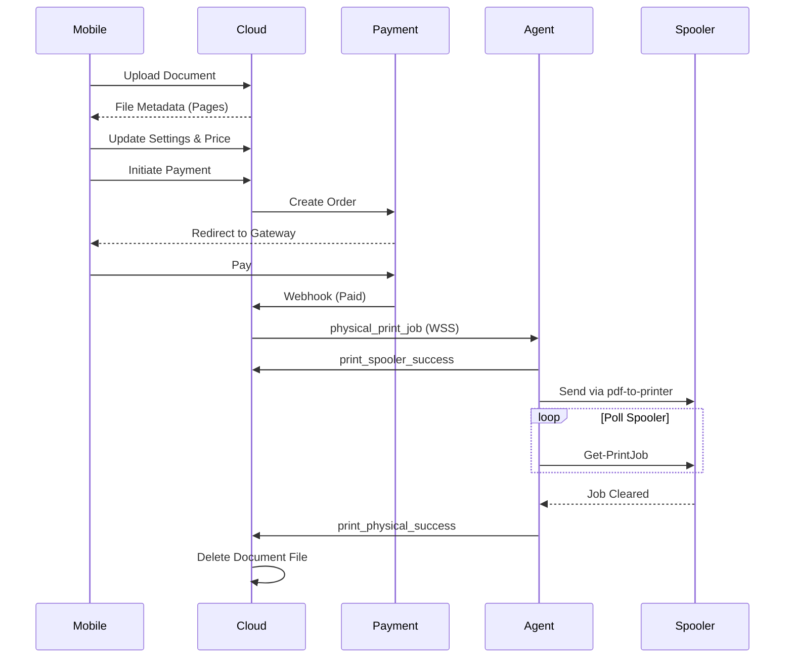
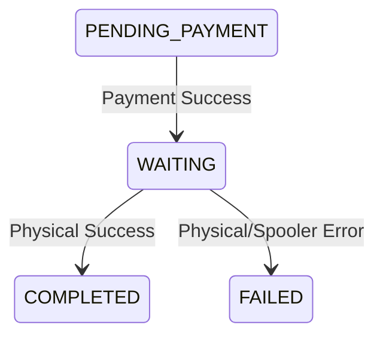

# PrintGo Architecture

## 1. Architecture Overview

PrintGo is a smart unattended printing platform.

### Current System
The current system connects a customer's mobile device to a physical kiosk via a WebSocket session. The cloud backend manages files, settings, and payments (via Cashfree), and relays the print job to a Windows-based Printer Agent running on the kiosk hardware, which interfaces with the Windows Print Spooler.

### Planned System
Future enhancements include Razorpay integration, automated OTA (Over-The-Air) updates securely verified without relying on Git, and native hardware-level telemetry reporting.

---

## 2. System Context



---

## 3. High-Level Architecture



---

## 4. Component Architecture

| Component | Responsibility | Communication | Security |
|-----------|----------------|---------------|----------|
| Cloud Backend | Core business logic, auth, API, state | REST / WSS | JWT, Rate Limiting |
| Kiosk Frontend | Displays QR, waiting states, success | WSS | Session Token |
| Mobile Frontend | File upload, settings, payment UI | REST / WSS | Session Token |
| Printer Agent | Receives jobs, polls spooler, prints | WSS | Machine Key Auth |
| PostgreSQL | Relational data storage | TCP | Internal Network |
| Cashfree | Payment processing & webhooks | HTTP | Webhook Signatures |

---

## 5. Backend Architecture

The backend follows a modular, feature-based architecture.

```
backend/
├── prisma/
│   └── schema.prisma        # Database schema
├── src/
│   ├── middlewares/         # Auth, error handling
│   ├── modules/             # Feature-based slices (auth, companies, jobs, machines, payments, subscriptions, upload)
│   ├── services/            # Background workers (BullMQ with in-memory fallback)
│   ├── utils/               # AppError, logger, prisma, stateMachine
│   ├── server.js            # Express entry point
│   └── socket.js            # WebSocket event handler
```

---

## 6. Data Architecture

The application uses PostgreSQL with Prisma ORM.

**Core Entities:**
- `Company`: Franchisee owner of machines.
- `User`: Admin/Staff tied to a company.
- `Machine`: Physical kiosk hardware.
- `Session`: Temporary connection between Kiosk and Mobile.
- `Plan` & `Subscription`: SaaS tier enforcement for Machines.
- `Payment` & `Transaction`: Financial records linked to Cashfree.
- `Document`: Metadata for uploaded files.
- `PrintJob`: A print request tied to Document, Machine, Customer, and Payment.
- `PrinterStatus`: Telemetry for machine health.


*Note: Telemetry charts are planned, but current schema supports PrinterStatus for basic online/paper/jam status.*

---

## 7. Multi-Tenant Architecture

Tenant isolation is implemented primarily through the `Company` entity.

- **Users & Machines** belong to a `Company`.
- **Jobs & Documents** are tied to a `Machine`, and thus transitively to a `Company`.
- **Authorization Enforcement:** SuperAdmins have global access. Franchisee Users can only refund payments or manage machines linked to their `companyId` (enforced in `payments.service.js`).

*Current Implementation Limitation:* Deep tenant boundary enforcement across all API routes requires ongoing audit to ensure no ID-guessing vulnerabilities exist across tenant boundaries.

---

## 8. Authentication

- **Users (Admins/Staff):** Authenticated via JWT (`JWT_SECRET`).
- **Printer Agent:** Authenticated via a static `machineKey` stored in the database and passed in the WebSocket handshake.
- **Kiosk/Mobile Sessions:** Authenticated via ephemeral JWT session tokens (type: `session`).

---

## 9. Authorization

- **SUPERADMIN:** Full access to all companies, machines, jobs, and refunds.
- **FRANCHISEE:** Access restricted to resources linked to their `companyId` (e.g., can only refund jobs for their own machines).
- **STAFF:** Limited operational access (read-only monitoring, basic support).

---

## 10. Customer Printing Flow



---

## 11. Session Architecture

- Kiosk generates a QR code containing a session URL.
- The backend tracks session state (`WAITING_FOR_MOBILE`, `CONNECTED`, `COMPLETED`, `EXPIRED`).
- Socket events synchronize UI between the mobile device and the physical kiosk display.

---

## 12. WebSocket Architecture

| Event | Sender | Receiver | Auth | Purpose |
|-------|--------|----------|------|---------|
| `join_session` | Kiosk/Mobile | Cloud | Session JWT | Joins socket to session room |
| `mobile_connected` | Mobile | Kiosk | Session JWT | Notifies kiosk to show connected UI |
| `file_uploaded` | Mobile | Kiosk | Session JWT | Notifies kiosk of upload |
| `settings_updated` | Mobile | Kiosk | Session JWT | Syncs print settings & price |
| `payment_initiated`| Mobile | Kiosk | Session JWT | Shows payment waiting on kiosk |
| `payment_success` | Mobile | Kiosk | Session JWT | Shows success on kiosk |
| `heartbeat` | Agent | Cloud | MachineKey | Updates `lastOnline` status |
| `printer_status_update`| Agent | Cloud | MachineKey | Reports paper out, offline, jams |
| `physical_print_job` | Cloud | Agent | MachineKey | Sends document URL & settings |
| `print_spooler_success`| Agent | Cloud | MachineKey | Acknowledges spooler acceptance |
| `print_physical_success`| Agent | Cloud | MachineKey | Confirms physical completion |
| `print_physical_error` | Agent | Cloud | MachineKey | Reports spooler/printer failure |

---

## 13. Payment Architecture

Integrated with Cashfree.
- **Order Creation:** Backend calculates authoritative price and creates a Cashfree order.
- **Verification:** Verification occurs via server-side polling/webhooks (`verifyPayment`).
- **Refunds:** Fully implemented. If a print job fails physically (`print_physical_error`), the backend automatically issues a refund via the Cashfree API.

---

## 14. Print Job State Machine



*Note: The system now waits for `print_physical_success` before marking as `COMPLETED`.*

---

## 15. Document/File Architecture

- **Upload:** Processed via `multer` (supports local or S3 depending on config).
- **Validation:** Only valid document mimetypes are accepted (PDFs usually).
- **Retention & Privacy:** Documents are automatically deleted 5 minutes after a job enters a terminal state (`COMPLETED` or `FAILED`).

---

## 16. Printer Agent

Node.js desktop agent running on Windows.
- **Hardware Integration:** Uses `pdf-to-printer` for physical printing.
- **Spooler Monitoring:** Uses PowerShell (`Get-PrintJob`) to poll the Windows spooler to determine true physical completion or errors (Paper Out, Paper Jam).
- **Simulation Mode:** Falls back to simulation if `PRINTER_NAME` is missing or invalid.

---

## 17. Kiosk Architecture

The kiosk consists of:
- Windows mini-PC.
- Web-based Kiosk UI (React/Vite).
- Node.js Printer Agent running as a background service (PM2).
- Physical Printer (connected via USB/Network).

---

## 18. Machine Architecture

Machines are provisioned with a `machineKey`. If a machine's status is `SUSPENDED`, the WebSocket connection is rejected, locking down the kiosk.

---

## 19. Subscription Architecture

Machines belong to a `Company` and are tied to a `Subscription` with a `Plan`. Subscription enforcement is modeled but relies on the backend changing machine status to `SUSPENDED` upon expiration.

---

## 20. Queue / Worker Architecture

Uses BullMQ for background tasks, backed by Redis for multi-instance scaling.
An in-memory fallback exists strictly for simplified local development.

---

## 21. Failure Handling

- **Printer Errors:** Paper out, paper jam, or spooler timeout triggers `print_physical_error`, leading to automated Cashfree refunds.
- **Network Failure:** Agent reconnects automatically via Socket.io.
- **Invalid Input:** Backend validates all state transitions using `stateMachine.js`.

---

## 22. Security Architecture

- **WebSockets:** Validated via JWT (Session/Admin) or MachineKey (Agent).
- **Agent Input:** The agent strictly validates job IDs (`/^[a-zA-Z0-9_-]+$/`) to prevent Command Injection in PowerShell.
- **Payments:** Verified strictly server-side.

---

## 23. OTA Architecture

The Printer Agent includes an `updater.js` script.
- **Mechanism:** Fetches a pinned git hash from the backend API, checks it out via `git`, runs `npm install`, and restarts the PM2 process.
- *Known Security Limitation:* The updater fetches via HTTPS but executes arbitrary shell commands based on the backend response. If the backend is compromised, the kiosk fleet is compromised.

---

## 24. Privacy/Data Lifecycle

UPLOAD -> PROCESS (Page Count) -> STORE -> PRINT -> CLEANUP (Deleted after 5 mins) -> DELETE.

---

## 25. Observability

- **Logs:** Centralized `logger.js` (Winston).
- **Telemetry:** Printer Agent sends memory usage, uptime, and printer status every 30s. Stored in `PrinterStatus`.

---

## 26. Scalability

- **Backend:** Stateless Express API + Socket.io (Configured with `@socket.io/redis-adapter` for multi-instance scaling).
- **Scaling Considerations:** Redis handles synchronization across Node.js instances for both BullMQ queues and WebSocket events.

---

## 27. Deployment Architecture

- **Cloud:** `render.yaml` and `docker-compose.yml` provided for backend/db deployment.
- **Local:** Kiosk runs via PM2 and `.bat` startup scripts.

---

## 28. Security/Architecture Invariants

1. Client input is untrusted.
2. Backend determines authoritative price.
3. Payment verification is server-side.
4. Duplicate print jobs must not be processed twice.
5. Documents must be deleted after printing (5 min grace period).

---

## 29. Known Limitations

- OTA Updates rely on Git and PM2 locally, which may be brittle on unmanaged Windows environments.

---

## 30. Future Architecture

### Planned
- Razorpay Integration.
- Comprehensive Dashboard Telemetry charts.

### Future
- End-to-end encrypted file transit.
- Native desktop agent (Rust/C++) instead of Node.js for smaller footprint.
